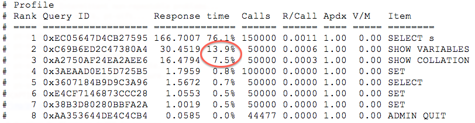
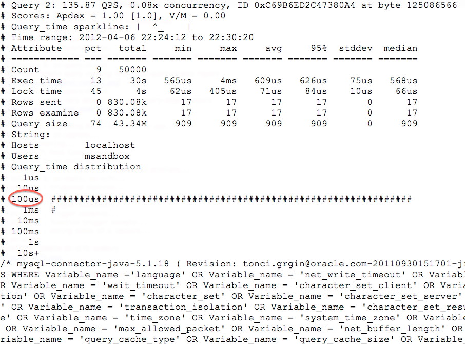
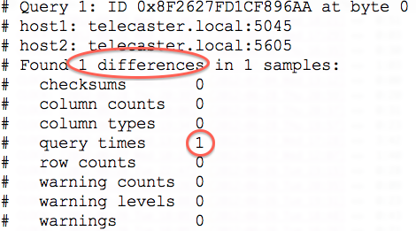
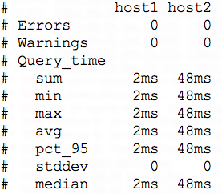
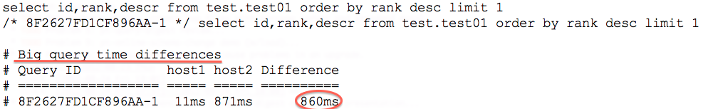
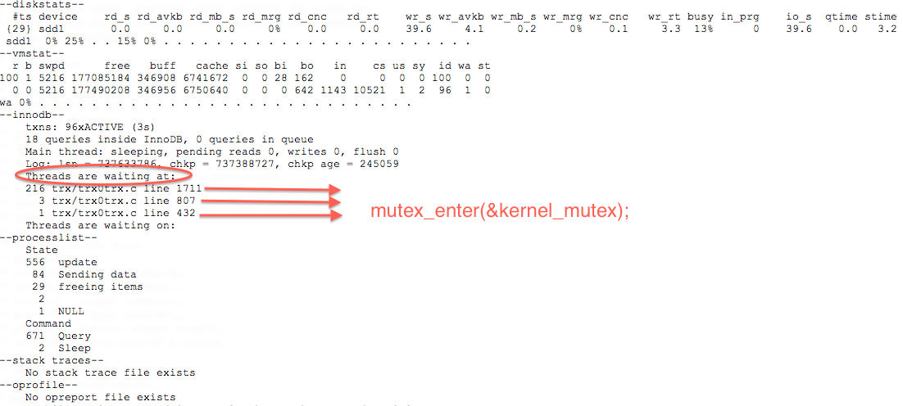

Percona toolkit recipes
===

Percona Live New York 2012

!

Introduction
===

!

About us
===

- Marcus Albe - Support Engineer @Percona
- Fernando Ipar - Senior Consultant @Percona
- Ryan Lowe - Production Engineer @Square

!

Presentation overview
===

!

- What is Percona Toolkit & Why should you be here?
- Classes of problems solved by Percona Toolkit
- Targeted recipes for specific problems
- Further resources & Recommended reading
- Q&A

!

What is Percona Toolkit?
===

Percona Toolkit is a collection of advanced command-line tools to perform a variety of MySQL and system tasks that are too tedious and/or complex to perform manually.

<!--- 
Can do a quick poll here to see who uses it, who *wants* to use it, etc...
-->

!

Why should you be here?
===

**Don't** reinvent the wheel

<!---
Most of us have a very large collection of scripts that we've created over the years, right?
How many of you have unit tests for those scripts?
How many of you have validated that those scripts work in 4.1, 5.0, 5.1, 5.5, Percona-Server, MariaDB, and Drizzle?
How many of you have tens-of-thousands of implementations of those scripts to catch undocumented edge-cases?
How many of you have a full time team of developers working on those scripts?
Right. This is why you should be here.  Make your life easier and re-use existing tools.
-->

!

Problems
===

- Replication
- Performance
- Upgrading
- Troubleshooting
- Schema Changes

<!---
Percona Toolkit helps to solve a wide variety of problems that MySQL DBAs encounter
on a regular basis.  The problems include Replication issues, Performance problems,
Upgrade safety, Troubleshooting and investigationg hard-to-diagnose problems, and
Schema changes for very large tables. This isn't an exhaustive list, but we only
have 45 minutes, so this is what we'll cover today
-->

!

Recipes 
===

!

Replication
===

!

Problem 1: Master and slave MAY  have different data
===

!

- Statements unsafe for replication (CURRENT_USER(), etc)
- Incorrect failover procedures
- Developers writing directly to the slave
- Rolling upgrades
- Storage Engines
- Temporary Tables
- Replication Filters

!

Solution 1 : pt-table-checksum
===

	pt-table-checksum --tables dbname.tbname \
	  h=master,u=user,p=password

!

Problem 2: Master and slave DO  have different data
===

Same reasons as Problem 1, but validated via Solution 1

!

Solution 2: pt-table-sync
===

Demo: resyncing two instances

<!---
TODO: Mention gotchas (like impossibility to throttle the process)
TODO: short demo
-->

!

Problem 3: SQL Injection + long restore times
===

!

Solution 3: pt-slave-delay
===

Demo: restoring from a delayed slave

!

Performance
===

!

Problem 4: Slow queries
===

Amdahl's Law 

<!---
The performance enhancement possible with a given improvement is
limited by the fraction of the execution time that the improved
feature is used. 
-->

!

Solution 4: pt-query-digest
===
Demo: Analyzing a query log looking for candidates for performance optimization
<!---
TODO: demo
-->
!

Problem 5: Rapid Development & Constantly Changing Workload
===

!

Solution 5: pt-query-digest
===

!

Solution 5: pt-query-digest
===

!

Upgrading
===

!

Problem 6: Upgrading MySQL can break my app
===

!

Solution 5: pt-upgrade
===

2 ways to upgrade MySQL:
- Reckless
- Safe
- http://bit.ly/upgrading-mysql

<!--- 
TODO: slides showing basic usage and a report
-->

!

!

!

!

Troubleshooting
===

!

Problem 7: Intermittent non-repeatable problems
===

!

Solution 7: pt-stalk & pt-sift
===

Why?

"Everything freezes at random times"

<!---
TODO: Generate problem cases so we can create slides with good
capture data
-->

!

pt-stalk: triggered captures
===

!

Triggers based on 

- show global status
- show full processlist
- user defined function

!

Some examples
===

!

	pt-stalk --function processlist --variable Command --match Sleep
	  --threshold 155 --cycles 0

<!---
Trigger if we're using a thread pool and more threads are connected
and sleeping than the size of the pol plus some room for a few
direct connections. 
-->

!

	pt-stalk --threshold 40 --cycles 6
	
<!--- 
Trigger if more than 40 threads are running for more than 5
consecutive checks
-->

!
	pt-stalk --function check_loadavg.sh --threshold 12
<!---
triggers if load avg for the last minute is more than 12.x for 5
consecutive checks or more
-->

!

	function trg_plugin() 	
	{	
	uptime |sed 's/.*load average: //g;s/\..*//g'	
	}

!

pt-stalk : making sense of a capture
===

Now ... Where do we start?

pt-sift!

!

Sample pt-sift summary

!

Schema changes
===

!

Problem 9: blocking alter statements
===

!

Solution 9: pt-online-schema-change
===

<!---
TODO: demo
-->

!

Resources
===

http://bit.ly/pt-recipes

!

Questions?
===

!
